# The tract, drawn

Thirteen figures, redrawn from the declared geometry by `make figures`. They are checked in so a reader gets them without running anything, and so a change to the geometry shows up in a diff as a changed picture rather than as four characters in an XML attribute.

Everything below comes from `ipakit.tract.Head.project` — the same call any renderer would make. The drawing computes no geometry of its own, which is why it is useful as a check: when the projection was wrong, the picture was wrong in a way the numbers were not.

## The reference

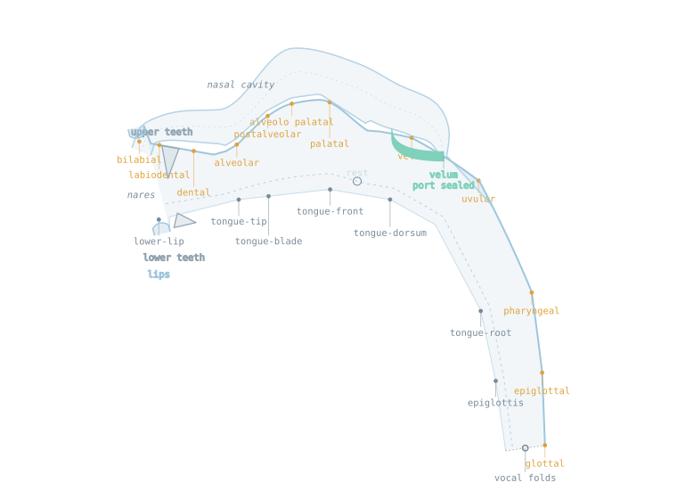

Every landmark the head declares, at the rest posture. Figures for individual phones name only the landmarks that phone uses, so this one is the key to those. [tract-reference.md](tract-reference.md) has the declared positions and where each number came from.

## How to read it

The head faces **left**: the lips are on the left, the glottis on the right. That matches the orientation of the IPA vowel chart, where front vowels sit left and back vowels right, so a tract figure and a vowel chart can be read side by side without mirroring either.

The **wall** is fixed: palate, teeth, pharyngeal wall. The **articulator** sweeps between fully open, at the midline, and closed against that wall. The shaded band is that sweep and the dashed line inside it is the rest position. A constriction is therefore a place along the tract and a degree of closure — exactly what `arc` and `offset` hold.

The tongue is one body, so a constriction deforms its whole surface rather than marking a point: moving it carries the tip, blade and dorsum along, with a raised-cosine falloff over the span the tongue bounds.

The **velic port** opens when a segment states nasality, read from the `nasality` bridge in `ipa.xml` — the same declaration the metric uses, so the geometry and the distance cannot disagree about what counts as nasal. A lowered velum leaves a gap in the oral roof, because the velum is part of that boundary.

Places drawn in amber host a fricative or affricate somewhere in the inventory.

## Closure, and where it is made

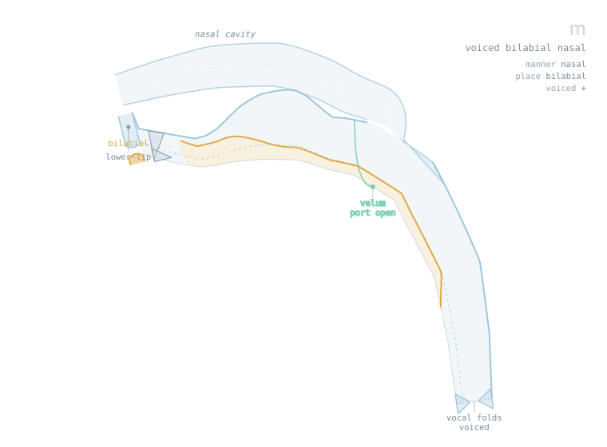
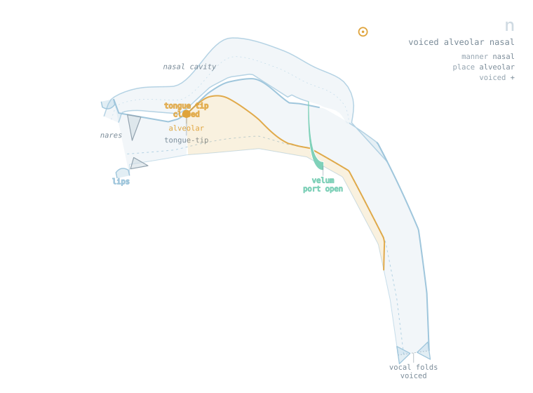

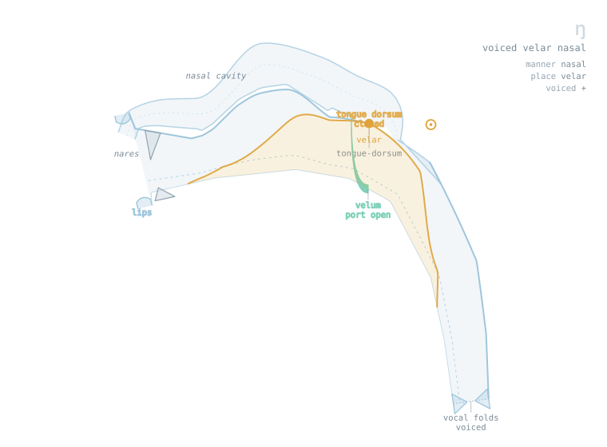

`m`, `n` and `k` are all complete closures — `offset` 1.0 — and they differ only in where. The lips meet for `m`, the tongue tip reaches the alveolar ridge for `n`, the dorsum meets the velum for `k`. Note what the velum is doing: open for the two nasals, sealed for `k`. A lowered velum opens the nose; it never closes the mouth, which is why `m` needs its lips shut as well.

`b` and `m` would differ in these figures only in the velic port. That is the whole contrast.

## Degree, and the sibilants

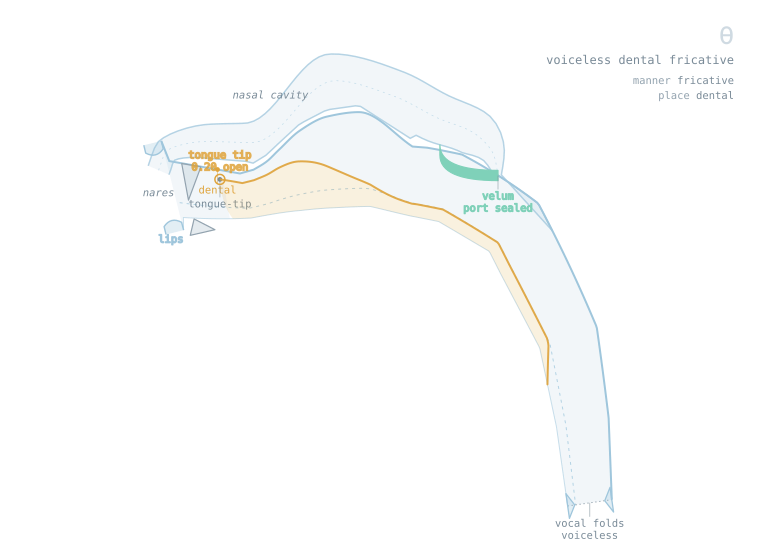
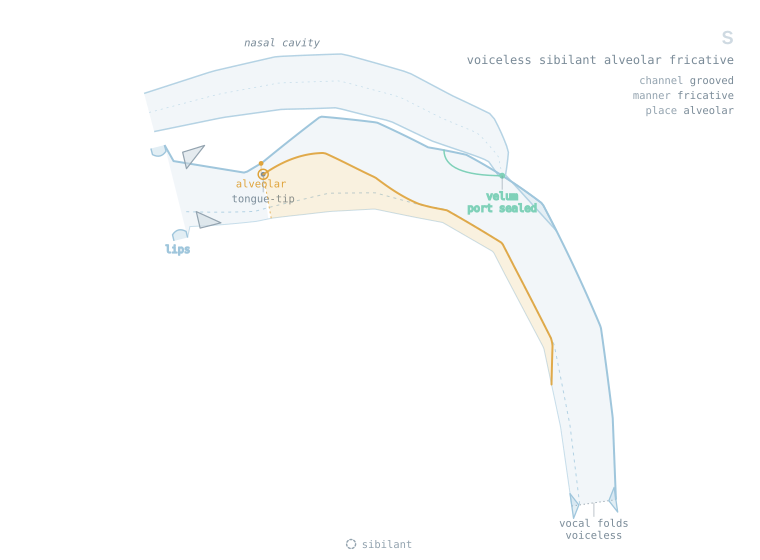
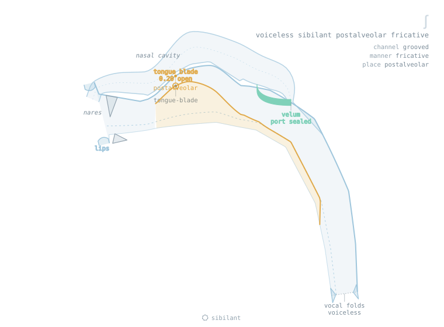

`θ`, `s` and `ʃ` share a degree of closure and differ in place, the constriction walking back from arc 0.08 through 0.13 to 0.19. That is the front-cavity length difference that separates them acoustically.

What these figures cannot show is the other half of the contrast: `ʃ` and `s` also differ in `channel`, which is the `+z` axis. A mid-sagittal section projects that axis away — the feature's own declaration in `ipa.xml` says so — and no drawing in this plane will ever show grooving or laterality. The caption carries what the picture cannot.

## Vowels

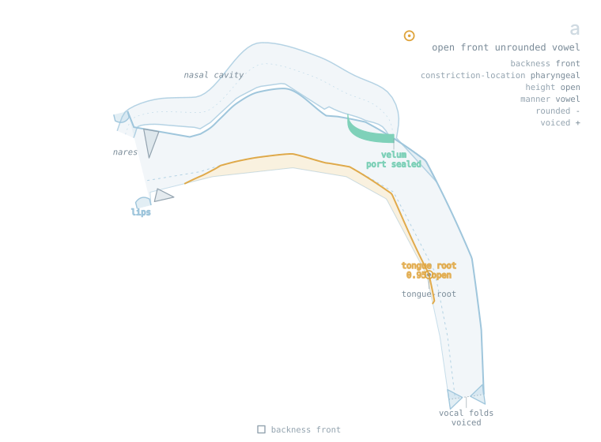
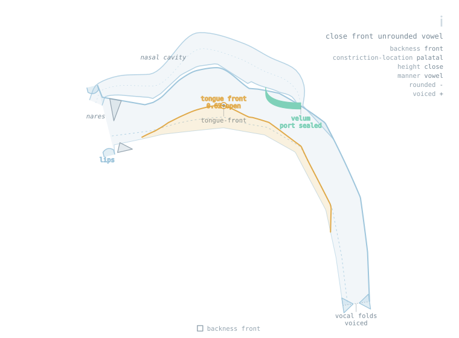
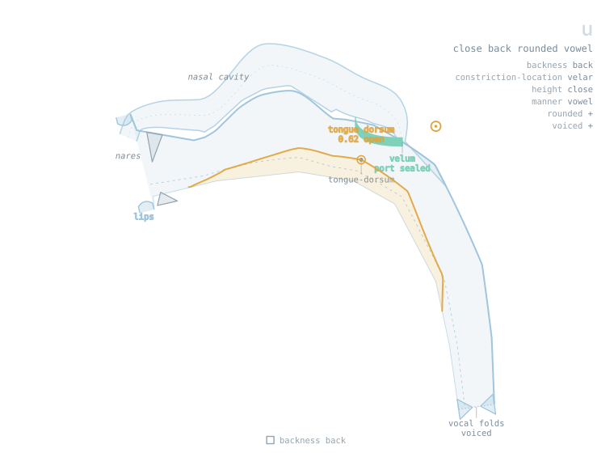

Vowels state backness and height rather than place, so no place is named. The tongue body moves and its whole surface goes with it.

## Silence

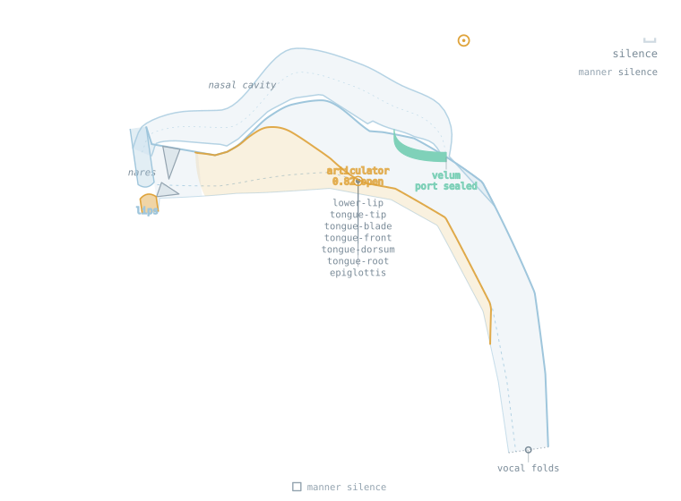

`␣` is featurally null and has no articulatory position, so it is drawn at the posture the head declares for not speaking: lips together, tongue at rest, jaw closed.

## What the figures are not

They are a projection of a model, not a measurement. Only the aperture over arc 0.20–0.40 is measured, from the X-Ray Microbeam database; the nasal branch, the teeth, the tongue's falloff and the whole child head are hand-placed, and each point in `heads.xml` says which it is. See [articulatory-data.md](articulatory-data.md) for what that corpus can and cannot ground, and [tract-anatomy.md](tract-anatomy.md) for the specification these figures are an incomplete implementation of.

Two limits worth knowing before reading anything into them. The posture carries place and degree but not voicing, laterality, secondary articulation or airstream, so 139 phones resolve to 66 distinct drawings. And the geometry is not simulable as it stands — see §10 of the anatomy document.
